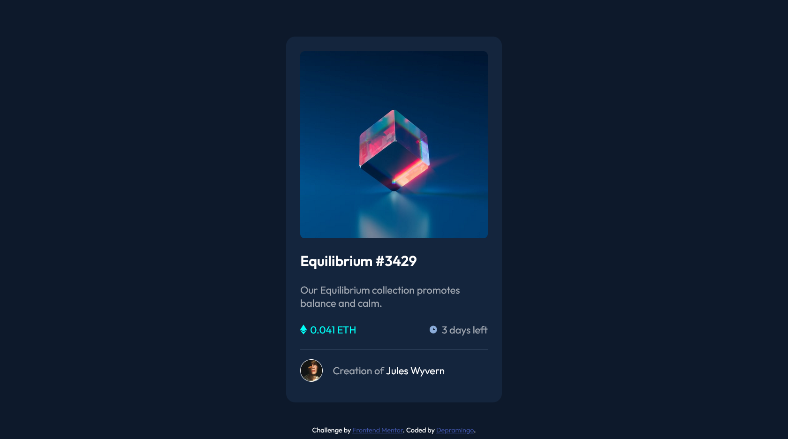

# Frontend Mentor - NFT preview card component solution

This is a solution to the [NFT preview card component challenge on Frontend Mentor](https://www.frontendmentor.io/challenges/nft-preview-card-component-SbdUL_w0U). Frontend Mentor challenges help you improve your coding skills by building realistic projects.

## Table of contents

-   [Overview](#overview)
    -   [The challenge](#the-challenge)
    -   [Screenshot](#screenshot)
    -   [Links](#links)
-   [My process](#my-process)
    -   [Built with](#built-with)
    -   [What I learned](#what-i-learned)
    -   [Continued development](#continued-development)
-   [Author](#author)
-   [Acknowledgments](#acknowledgments)

## Overview

### The challenge

Users should be able to:

-   View the optimal layout depending on their device's screen size
-   See hover states for interactive elements

### Screenshot



### Links

-   Solution URL: [Add solution URL here](https://your-solution-url.com)
-   Live Site URL: [live site](https://depramingo.github.io/nft-preview-card-component/)

## My process

### Built with

-   Semantic HTML5 markup
-   CSS
-   Flexbox
-   Mobile-first workflow

### What I learned

-   Fully understood box-sizing even more
-   Used CSS variables
-   Actually used hover effects
-   Positions
-   How to make an overlay
-   Footer Block - forcing the footer to always stay in the bottom of the page, learned from w3schools:

```css
.attribution {
    position: fixed;
    left: 0;
    bottom: 0.5rem;
    width: 100%;
    color: white;
    text-align: center;
}
```

### Continued development

Still:

-   CSS cubic-bezier function
-   CSS transition & transform properties

## Author

-   Frontend Mentor - [@Depramingo](https://www.frontendmentor.io/profile/Depramingo)

## Acknowledgments

-   Thank you, Senofy!!!
